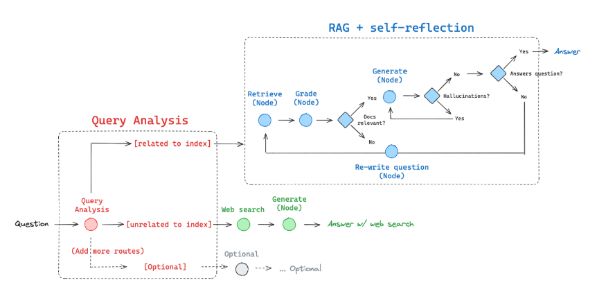

# Adaptive RAG Chatbot for Company Evaluation

## Project Overview
This project was developed as part of a company evaluation process, where I was given two documents and tasked with creating a chatbot. The general approach involved building an **adaptive Retrieval-Augmented Generation (RAG)** system using the following technologies:

- **LangGraph** – To control the workflow and decision-making logic  
- **Pinecone** – As a vector database for efficient retrieval  
- **OpenAI (GPT-4o)** – As the chat model for generating responses  
- **OpenAI Embeddings** – To convert text into vectors and store them in Pinecone  
- **Streamlit** – To design the web interface and deploy on Streamlit Cloud  

## Why Use Adaptive RAG?
Adaptive RAG is an innovative strategy for Retrieval-Augmented Generation (RAG) that combines query analysis with active and self-corrective RAG techniques. This approach aims to optimize the retrieval and generation process by dynamically adapting to the nature of the query.

## Why Not LLaMA 2?
While considering different models, I initially explored **LLaMA 2**, but faced several challenges:

1. **Ollama** – Running locally was fast, but it does not support cloud hosting.  
2. **Hugging Face Transformers** – The **meta-llama** model required a **Pro subscription** for optimal use.  
3. **CTransformers** – Small models did not perform well, while large models had **slow response times** due to my **limited physical and RAM memory**.  

Ultimately, **GPT-4o** from OpenAI provided the best performance given my hardware and deployment constraints.  

## Enhancements & Future Improvements
To further improve the chatbot's performance and domain-specific accuracy, the following enhancements are planned:

### Fine-Tuning
- **Dataset Generation** – Use **ChatGPT** to generate high-quality datasets for fine-tuning.  
- **Fine-Tuning with Unsloth** – Leverage **Unsloth** for efficient model fine-tuning on domain-specific data.

